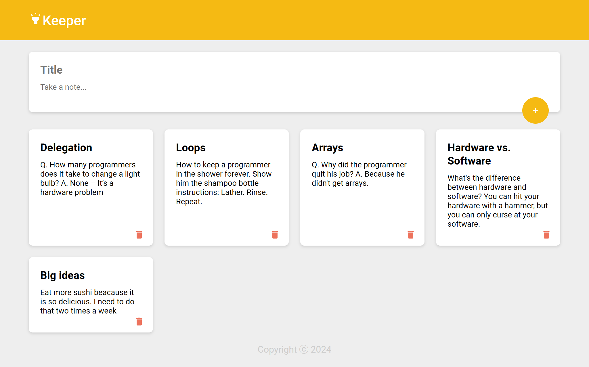

# Keeper Application

A note-taking tool similar to Google Keep, developed in React.

## Table of Contents

1. [Description](#description)
2. [Screenshot](#screenshot)
3. [Features](#features)
4. [Links](#links)
5. [Technologies Used](#technologies-used)
6. [Libraries Used](#libraries-used)
7. [Application Structure](#application-structure)
8. [Application Flow](#application-flow)

## Description

The Keeper application is a note-taking tool that allows users to create, store, and delete notes, with data being saved in the browser's `localStorage` for persistence.

## Screenshot

## Features

- Create and save notes
- Delete notes
- Persist notes using `localStorage`
- Responsive and user-friendly interface

## Links

- [Live Application](https://keeper-lilac-phi.vercel.app/)
- [GitHub Repository](https://github.com/nascimentolds/keeper)

## Technologies Used

- **JavaScript (ES6+)**
- **React**
- **CSS**
- **LocalStorage**

## Libraries Used

1. **React**: Library for building the interface.
2. **React Icons**: Icons for the interface (`MdHighlight`, `MdDelete`, `MdAdd`).
3. **Nanoid**: Generating unique IDs for notes.
4. **@mui/material**: Interface animations (`Zoom`).

## Application Structure

- **App**: Main component that renders `Header`, `Main`, and `Footer`.
- **Header**: Displays the application title with an icon.
- **Main**: Manages the state of notes, renders `AddNote` and the list of `Note`.
- **Note**: Shows a note with title, content, and a delete button.
- **AddNote**: Form for adding notes, with expansion and warning if fields are empty.
- **Footer**: Displays the current year in the footer.

## Application Flow

1. **Initialization**: Loads notes from `localStorage`.
2. **Add Note**: User fills out the form and adds a note.
3. **Persistence**: `useEffect` updates `localStorage` when notes change.
4. **Delete Note**: User deletes a note by clicking the delete icon.

---

Feel free to contribute, open issues, or suggest improvements!
